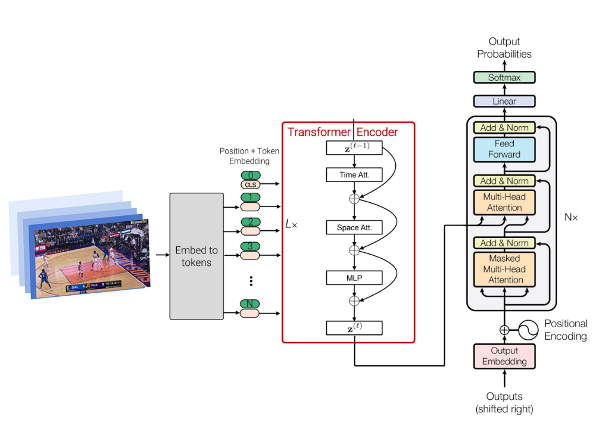

# 🏀 About HoopsTalk

HoopsTalk harnesses the power of generative AI to provide engaging and ensuring a comprehensive and immersive experience for fans.
Our proposed caption generating architecture consists of (i) TimeSformer Encoder and (ii) Transformer-based Decoder with multi-head self attention.

## Webscraper
1. Get the data from https://www.dropbox.com/sh/x3zpttp7bjevb3r/AAAeFLnIeBMBXa9DNQD4a8TOa?e=2&dl=0 and put the content inside `data/raw/NSVA_Data/NSVA_Data`.
2. Run the `webscraper.py`
3. Take note the games have been selected to just 'dal' games. Refers to 'dallas mavericks'.

## Generate Caption - Inference
1. go to `notebooks/inference.ipynb`
2. make your own `generate_captions` model
3. On last cell of the notebook, run the for loop and make the minor changes as needed / video data used can be found in [gdrive link here](https://drive.google.com/drive/folders/1GIgMOJOQNFMnY3jWZFEgM9kViq-IrUoP?usp=sharing) 

## Text Personification
1. Install required library `pip install langchain-openai==0.1.7` or just run `pip install -r requirements.txt`.
2. Since the model is from local, follow install instruction for [LM Studio](https://lmstudio.ai) / [LocalAI](https://localai.io).
3. Run `python src/text_personification.py` from the root directory (or anywhere, doesn't matter).
4. The script will output both personified text and token usage

## Text-to-Speech
1. Download the models from https://huggingface.co/enlyth/baj-tts/tree/main/models and put it inside the `models` directory
2. Install the requirements, `pip install TTS==0.22.0` or just run `pip install -r requirements.txt`.
3. Run `python src/tts.py` from the root directory.
4. Check the generated `.wav` file in `output` directory.

## MAIN
This is the main program. The models will run given captions of the videos, and will return a `.wav` file for the output personified caption.
1. Run `python main.py` from the root directory.
